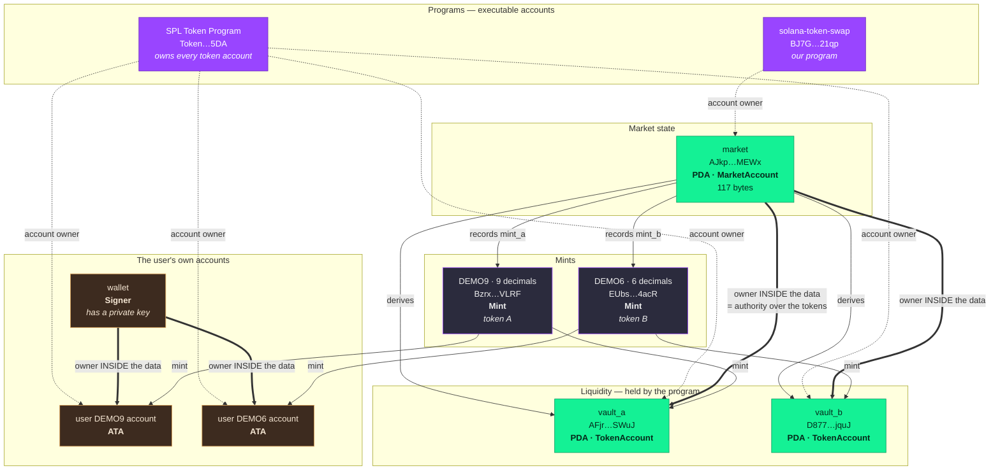
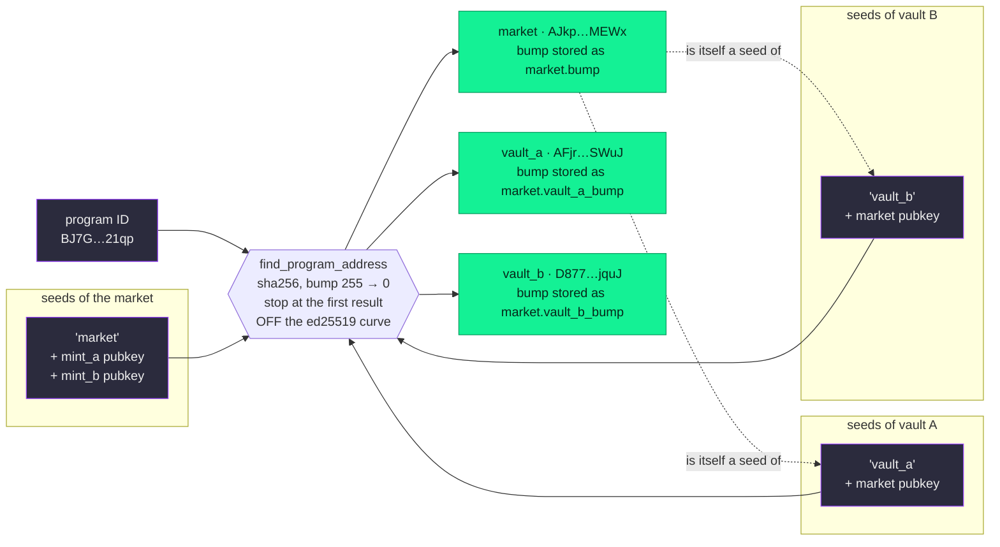
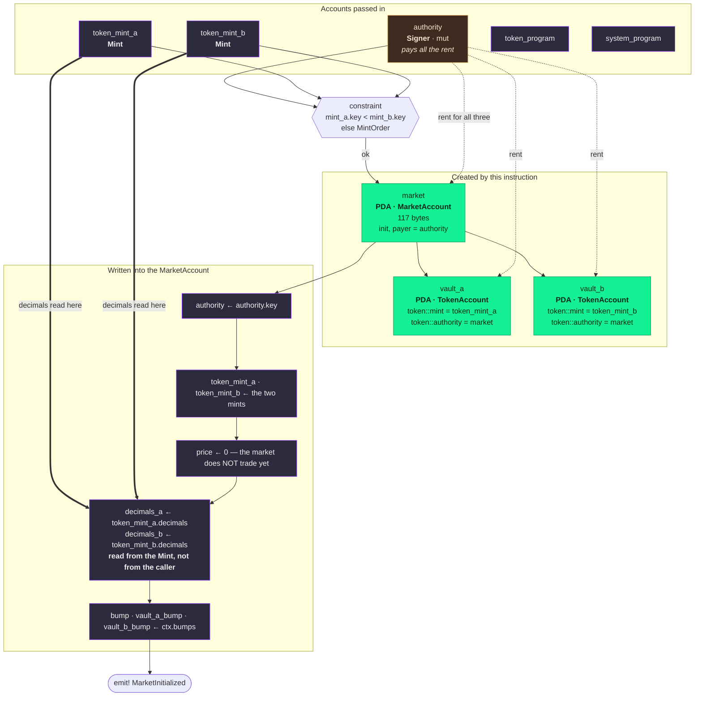
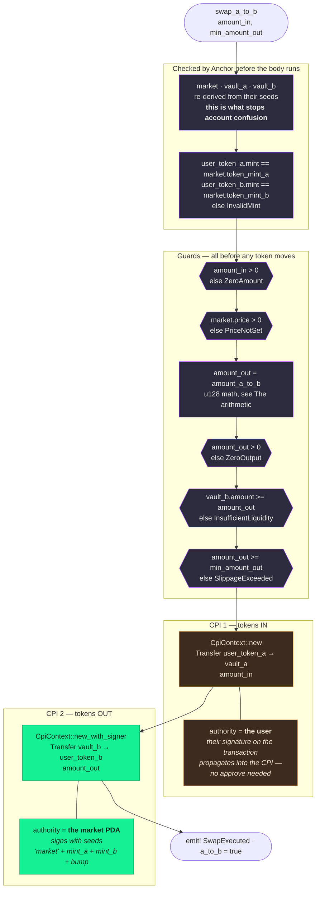
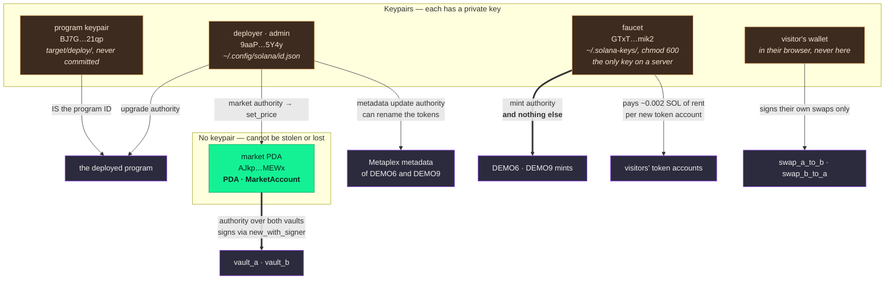

# solana-token-swap

         [](https://solana-token-swap.vercel.app/) 

A fixed-price SPL token swap on Solana, written in Rust with Anchor 1.2.0.

My first Solana program, coming from Solidity and Cairo. Built as Module 15 of the CodeCrypto Master's in Blockchain Engineering & AI.

> **Status:** phases 0–8 done, phase 9 in progress · 27 program tests + 96 frontend tests passing · `yarn typecheck:all` clean · **deployed on devnet and exercised with a real round trip** · **[live demo](https://solana-token-swap.vercel.app/)** with a working faucet · not audited, educational code.

**Live demo → [solana-token-swap.vercel.app](https://solana-token-swap.vercel.app/)**

---

## Contents

| | |
|---|---|
| **Start here** | [Live demo](#live-demo) · [What it does](#what-it-does) · [Instructions](#instructions) |
| **The design** | [Account design](#account-design) · [How an instruction runs](#how-an-instruction-runs) · [The arithmetic](#the-arithmetic) · [Design decisions](#design-decisions) · [Authority separation](#authority-separation) |
| **What is live** | [Devnet deployment](#devnet-deployment) · [Frontend and faucet](#frontend-and-faucet) |
| **Working on it** | [Running it](#running-it) · [Tests](#tests) · [Three pairs of tools](#three-pairs-of-tools-and-which-half-of-the-repo-each-checks) · [Toolchain](#toolchain) |
| **Honesty** | [Known limitations](#known-limitations) · [Roadmap](#roadmap) |

Five diagrams, one per thing worth understanding: [the account model](#the-complete-account-model), [PDA derivation](#how-the-pdas-are-derived), [`initialize_market`](#initialize_market), [a swap A→B](#a-swap-a-to-b-step-by-step) and [who controls what](#authority-separation).

---

## Live demo

[**solana-token-swap.vercel.app**](https://solana-token-swap.vercel.app/) — devnet, no setup required beyond a wallet.

1. Connect a Solana wallet set to **devnet** (Solflare and Phantom both work).
2. Press **Get test tokens**. The faucet mints you 10 DEMO9 and 20 DEMO6, and pays for your token accounts.
3. Swap in either direction. The market price is fixed at 1 DEMO9 = 2 DEMO6.

You need no devnet SOL to receive tokens — the faucet pays the rent — but you do need a little to send the swap itself.

## What it does

Each market pairs two SPL tokens and holds liquidity in two program-controlled vaults. The market authority sets a price, anyone can add liquidity, and users swap at that price.

**This is not an AMM.** The price is *stored* in a `u64` (6 fixed decimals, meaning "how much B per 1 A"), not derived from reserves like `x * y = k`. That makes the program responsible for guaranteeing, by construction, what an AMM gets for free from its equation: a coherent price in both directions.

## Instructions

| Instruction | Status | Who can call it |
|---|---|---|
| `initialize_market` | ✅ | Anyone (becomes the market authority) |
| `set_price` | ✅ | Market authority only |
| `add_liquidity` | ✅ | Any depositor |
| `swap_a_to_b` | ✅ | Any user |
| `swap_b_to_a` | ✅ | Any user |

---

## Account design

### The `MarketAccount`

One PDA per token pair holds everything the program needs to price a swap. **117 bytes on chain** — read off the deployed market: 8 for Anchor's discriminator plus 109 of data.

```rust
pub struct MarketAccount {
    pub authority: Pubkey,      // 32 — may change the price. Per-market, not per-program.
    pub token_mint_a: Pubkey,   // 32 — canonical order guarantees token_mint_a < token_mint_b
    pub token_mint_b: Pubkey,   // 32
    pub price: u64,             //  8 — scaled by 10^PRICE_DECIMALS. 0 means "not set yet"
    pub decimals_a: u8,         //  1 — read from the Mint, never from the caller
    pub decimals_b: u8,         //  1
    pub bump: u8,               //  1 — the market's own canonical bump
    pub vault_a_bump: u8,       //  1 — stored so a swap need not re-derive it
    pub vault_b_bump: u8,       //  1
}
```

The space is declared as `8 + MarketAccount::INIT_SPACE`, with `INIT_SPACE` generated by `#[derive(InitSpace)]` — not a hand-counted constant that silently goes stale when a field is added.

🇪🇸 **NOTA — por qué los bumps se guardan.** Derivar un PDA cuesta un `find_program_address`, que itera bumps hasta encontrar uno fuera de la curva: hasta 255 hashes en el peor caso, y cada hash cuesta compute units. Guardar el bump que ya salió al crear la cuenta convierte esa búsqueda en una sola verificación. Es el mismo razonamiento que cachear un `keccak256` en un `immutable` de Solidity, salvo que aquí el presupuesto que se protege son los 200.000 CU de la transacción.

### The complete account model



Legend: **dotted** arrows are the Solana account-level `owner` field · **thick** arrows are the `owner` written *inside* a token account's data · plain arrows are references stored in account data. Every address links from [the address table](#devnet-deployment).

### The two meanings of owner

This is the single most confusing thing about Solana coming from EVM, and the diagram above is drawn to take it apart rather than inherit it. **The word `owner` means two unrelated things**, one nested inside the other:

| | `owner` as an **account field** | `owner` **inside the token account data** |
|---|---|---|
| Lives in | The account header, every account has it | Bytes 32..64 of an SPL token account |
| Means | Which **program** may write these bytes | Which **key or PDA** may move these tokens |
| For `vault_a` | `TokenkegQ…` — the SPL Token Program | `AJkp…MEWx` — the market PDA |
| For the `market` | `BJ7G…21qp` — our own program | *does not apply, it is not a token account* |
| Changed by | Nothing, it is set at creation | `SetAuthority`, by the current owner |

Both rows for `vault_a` are read straight off the deployed account, not asserted:

```console
$ solana account AFjr2164TK4nYackkK6G4Aj8ZXWEycrhBEXaRCvJSWuJ --url devnet
  owner (account field):  TokenkegQfeZyiNwAJbNbGKPFXCWuBvf9Ss623VQ5DA   # SPL Token Program
  data[ 0..32]  mint:     Bzrx…VLRF                                     # DEMO9
  data[32..64]  owner:    AJkpcg6k51gitf2LomH92fVWdpLrCNFSdyoKPKxrMEWx  # the market PDA
```

🇪🇸 **NOTA — por qué en EVM no hay equivalente.** Un saldo de ERC-20 es una entrada de un `mapping(address => uint256)` que vive **dentro del storage del contrato del token**: no es una cuenta, no tiene dueño y no existe fuera de ese contrato. En Solana un saldo **es una cuenta independiente**, con su propia dirección, su propia renta y su propio dueño, y el programa del token solo es quien tiene permiso para editarla. De ahí las dos capas: el SPL Token Program es dueño de los *bytes*, y quien figura dentro de esos bytes es dueño de los *tokens*. Confundirlas lleva a buscar autorización donde no está — y el bug que sale de ahí es account confusion, no un error de permisos.

### How the PDAs are derived

A PDA has no private key. Its address is the hash of a program ID plus a list of seeds, and only that program can make the runtime treat it as a signer.



The literal seeds, exactly as the program declares them:

```rust
seeds = [b"market", token_mint_a.key().as_ref(), token_mint_b.key().as_ref()]
seeds = [b"vault_a", market.key().as_ref()]
seeds = [b"vault_b", market.key().as_ref()]
```

The market is a seed of both vaults, which is what makes each vault belong to exactly one market. That is the whole defence against [account confusion](#a-swap-a-to-b-step-by-step): a vault from another market derives a different address and Anchor rejects it before any code of ours runs.

🇪🇸 **NOTA — el bump canónico.** `find_program_address` prueba bumps **desde 255 hacia abajo** y se queda con el **primero** que caiga fuera de la curva ed25519 — porque un punto que esté *en* la curva podría tener clave privada, y entonces el PDA no sería exclusivo del programa. Ese primero es el **bump canónico**, y es el único que Anchor acepta: si un atacante pasara otro bump válido, obtendría una dirección distinta y válida para el mismo juego de seeds, es decir, una segunda cuenta donde debería haber una. Anchor evita esa clase entera de bug comparando siempre contra el canónico, y por eso `bump` sin valor en `init` y `bump = market.bump` después no son lo mismo escrito de dos maneras: el primero calcula el canónico, el segundo verifica contra el que ya se guardó.

### Why the vaults are PDAs

A vault is an ordinary SPL token account whose `owner` — the one inside the data — is a PDA instead of a wallet. **No private key exists for that address**, so no human can sign a transfer out of it. The only way tokens leave a vault is this program invoking the token program with the market's seeds, which the runtime accepts as a signature.

In Solidity the equivalent is a contract holding tokens: the balance sits under `address(this)` and only the contract's code can move it. The difference is that Solana has no `address(this)` — the program is stateless and owns nothing by default — so the account that plays that role has to be derived and passed in explicitly, and **verified on arrival** by re-deriving it from its seeds.

---

## How an instruction runs

### `initialize_market`



Three accounts are created and **the caller pays rent for all three** — about 0.0012 SOL for the market plus ~0.002 SOL per vault. The caller becomes the market authority by the act of calling; there is no admin list and no program-wide owner.

The instruction takes **no arguments at all**. Everything it stores it either derives or reads from an account it was given, which is why there is nothing here for a caller to lie about. The market leaves this instruction with `price = 0` and both swaps refuse to run until [`set_price`](#instructions) is called — a market that exists is not yet a market that trades.

### A swap A to B, step by step

The important one. Two CPIs into the SPL Token Program, **with different authorities**, in one transaction:



**Which vault empties depends on the direction, and it is the opposite one from the naive guess:**

| Direction | Input lands in | Output comes out of | Liquidity checked against |
|---|---|---|---|
| `swap_a_to_b` | `vault_a` | `vault_b` | `vault_b.amount` |
| `swap_b_to_a` | `vault_b` | `vault_a` | `vault_a.amount` |

Getting that pair crossed is a real bug with a plausible-looking failure: the swap succeeds whenever both vaults happen to hold enough, and only fails once one side runs low. Both directions have a test for it — `rejects a swap larger than the liquidity in vault_b` and its mirror.

🇪🇸 **NOTA — SPL Token SÍ tiene allowance, y aquí no hace falta.** La afirmación fácil ("en Solana no hay allowance") es falsa: una `TokenAccount` guarda `delegate` y `delegated_amount`, y el programa expone `Approve` y `Revoke`. Lo correcto es decir que **este programa no los necesita**, porque la firma del usuario sobre la transacción se propaga a las invocaciones que la transacción hace. La transacción previa de `approve` que en EVM es obligatoria aquí sobra — y con ella sobra toda la clase de bugs del `approve` infinito.

Y el detalle que más cuesta ver: las seeds del `new_with_signer` derivan **el mercado**, no la bóveda. El mismo PDA firma las dos direcciones; lo único que cambia es de qué cuenta salen los tokens. No es una firma criptográfica: es el runtime re-hasheando las seeds y aceptando que el programa las conoce.

---

## The arithmetic

### The two formulas

```
A→B:  amount_b = (amount_a × price × 10^dec_b) / (10^PRICE_DECIMALS × 10^dec_a)
B→A:  amount_a = (amount_b × 10^PRICE_DECIMALS × 10^dec_a) / (price × 10^dec_b)
```

They are an exact reflection of each other: `price` and `10^PRICE_DECIMALS` swap sides, and so do `dec_a` and `dec_b`. Writing them one under the other is the cheapest way to check a change to either.

### Three scales that are not the same

| | Value here | Decided by |
|---|---|---|
| `PRICE_DECIMALS` | 6 | A constant of the program |
| `decimals_a` | 9 | The mint that sorted first |
| `decimals_b` | 6 | The mint that sorted second |

⚠️ In the A→B denominator, two factors **can coincidentally be equal** — `10^PRICE_DECIMALS` and `10^dec_a` are both `10^6` whenever token A has 6 decimals. They are not the same quantity, and the token is not being multiplied by itself. With this deployment they differ (9 vs 6), which is exactly why the demo mints were given **6 and 9 decimals on purpose**: with equal decimals the factors cancel and a swapped-decimals bug still passes every test.

### Why `u128`, and why every multiplication comes first

**Every intermediate is `u128`, converted back with `try_into()`.** A `u64` is not enough: `amount × price × 10^9` reaches ~10²⁷ for realistic amounts, against a `u64::MAX` of ~1.8×10¹⁹. The overflow would not be theoretical — it arrives with ordinary numbers.

**Every multiplication happens before every division.** Not a style preference:

- Integer division **truncates**, so dividing early throws away precision that the later multiplication cannot recover.
- A nested division can collapse its denominator **to zero**, and the result is a panic or a wildly wrong number rather than a small rounding error.

The reference implementation this project started from had a nested division. It is one of the four bugs in that code, and it is the kind a linter does not find.

**Truncation must favour the pool in both directions**, and that is guaranteed by construction rather than by care: truncating can only ever *reduce* the output, and the output is what the pool pays. The test `never returns more than went in on a round trip A→B→A` is what holds that claim to account.

---

## Design decisions

The four that depart from the course's reference implementation, and why.

### Canonical mint order — `mint_a < mint_b`

Seeds are order-sensitive, so `(A, B)` and `(B, A)` derive **two different markets for the same pair**, each with its own independent price. That is not untidy, it is arbitrageable almost by construction, because **the exact inverse of a price is usually not representable in integer math.**

Worked through with the real formulas, for a pair priced at 1 A = 3 B:

| Step | Result |
|---|---|
| `1/3` stored with 6 decimals | `333333` → 0.333333, where the true value is 0.3333… |
| Sell 1 A into the **reversed** market | **3.000003 B** — the canonical one pays 3.000000 |
| Sell that B back into the **canonical** market | **1.000001 A** |
| **Profit per cycle** | **+0.000001 A, risk-free, linear in size** |

100 000 A round-tripped that way returns 100 000.1 A. Nobody has to be tricked and nothing has to go wrong: the two markets simply disagree in the seventh digit, forever, and the disagreement is free money. The constraint costs one comparison at market creation and removes the whole scenario.

The control that proves the problem is the *pair* of markets and not the arithmetic: **inside a single market, A→B→A returns exactly 1.0 and never more** — the program computes the inverse on the fly from the same stored price, so there is nothing to disagree with. That is the `never returns more than went in` test.

Same convention as Uniswap V2's `token0 < token1`, for the same reason.

🔴 **The order is decided by the pubkey comparison, not by decimals and not by value.** In this deployment the 9-decimal mint happens to sort first, which is a coincidence of two random addresses. Any test or client code that assumes "token A is the one with fewer decimals" is wrong — it already caused a failure in phase 4.

### Decimals are read from the `Mint`

Never accepted as instruction arguments. If the program can verify a value on its own, it must not trust the caller for it; the reference implementation took them as parameters, and a caller who passes `decimals_a = 6` for a 9-decimal token moves the price by a factor of a thousand.

The test that pins this down is named after the guarantee rather than the mechanism: `reads decimals from the mints instead of trusting the caller`.

### `min_amount_out` on both swaps

Solana has no public mempool, so the classic EVM sandwich does not transfer directly. **The real exposure here is different:** the market authority calls `set_price`, and your transaction lands after the change. Same outcome — a fill at a price you did not agree to — reached without an adversarial searcher.

`min_amount_out` is checked after the arithmetic and before any CPI, so a swap that would fill badly costs its sender a failed transaction and nothing else.

### Two swap instructions, not one with a direction flag

`swap_a_to_b` and `swap_b_to_a` are separate instructions rather than one taking `a_to_b: bool`. The flag version has one body doing two jobs, with every account name meaning a different thing depending on a runtime value, and `if direction` scattered through the guards, the arithmetic and both CPIs. Two instructions instead give Anchor's account structs a fixed meaning — `vault_b` is *always* where A→B pays from — which is what makes the constraints in the struct able to say anything at all.

The cost is a second nearly-symmetric function, and a real risk that a fix lands in one and not the other. The mirrored formulas and the paired tests are the countermeasure.

### The smaller ones

- **`set_price` requires `has_one = authority` *and* a `Signer`.** `has_one` compares pubkeys without requiring a signature; `Signer` requires a signature without checking whose. Only together do they add up to `require(msg.sender == market.authority)`.
- **`add_liquidity` with both amounts at zero fails** instead of returning `Ok` as a silent no-op — which is what the reference did.
- **`add_liquidity` is open to any depositor**, with no `has_one`. Liquidity is a gift to the pool; there is no LP token and no claim to give back, so there is nothing to protect by restricting who may give.
- **Depositor and user token accounts are checked against the market's mints** before any CPI, so the error says `InvalidMint` instead of surfacing an opaque failure from the token program.
- **Events are emitted but are not the frontend's source of state.** Solana has no `eth_getLogs`; market state and vault balances are read with `getAccountInfo`.
- **`init-if-needed` is switched off**, deliberately, everywhere. It lets an already-initialised account pass the constraint without error, so without an explicit check an attacker can re-initialise and **reset state**. Associated token accounts are created from the client instead, with `createAssociatedTokenAccountInstruction`.

---

## Authority separation

Four keypairs exist, and the one that can mint tokens is deliberately not the one that can do anything else. The fifth authority in the system has no keypair at all.



| Key | Controls | Explicitly cannot |
|---|---|---|
| Program keypair | Is the program ID | Nothing — it is an identity, not a permission |
| `9aaP…5Y4y` deployer | Program upgrades · `set_price` · metadata updates | **Mint tokens.** Verified by trying: `owner does not match` |
| `GTxT…mik2` faucet | Mint DEMO6 and DEMO9 · pay rent for new token accounts | Upgrade the program · change the price · **rename the tokens** |
| Visitor's wallet | Their own swaps and balances | Everything else |
| Market PDA *(no key)* | Moves tokens out of both vaults | Exist off-chain — **no private key was ever generated** |

**Why the faucet can only mint.** It is the one key that lives on a server, in an environment variable of a serverless function. Treating it as compromised is the only sane assumption, so the blast radius is capped by construction: an attacker with it can mint worthless demo tokens and drain at most the 0.5 SOL it was funded with. They cannot upgrade the program, move the price, touch the vaults, or make DEMO6 claim to be something it is not.

**Why the metadata update authority stayed with the deployer.** Creating the metadata required the *mint* authority to sign, so it had to happen **before** the transfer — once the faucet held the mint authority, only the faucet could have created it. But the update authority is a **stored field, not a signer**: it was set to `9aaP…5Y4y` and stays there. So the faucet mints and cannot rename. The token names are as trustworthy as the deployer key, not as trustworthy as the key sitting on Vercel.

Verified on chain rather than remembered, by reading the update authority out of the metadata accounts directly — 1 byte of `key`, then 32 bytes of update authority:

```console
$ solana account 2siGjiNUh4fvEdCFUBDMmNBejTu8bCsCabyKo1hhYtKQ --url devnet --output json
  DEMO6  key = 4 (MetadataV1)  update authority = 9aaPGTS7…Do15Y4y   ✅ not the faucet
  DEMO9  key = 4 (MetadataV1)  update authority = 9aaPGTS7…Do15Y4y   ✅ not the faucet
```

---

## Devnet deployment

The program is live on devnet with one seeded market. Every address below comes from [`devnet.json`](devnet.json), the manifest the deploy scripts write and read.

| What | Address |
|---|---|
| Program | [`BJ7GHy1zRe1VKuKUZU2ac2q1VQmtukmHzCpbo98m21qp`](https://explorer.solana.com/address/BJ7GHy1zRe1VKuKUZU2ac2q1VQmtukmHzCpbo98m21qp?cluster=devnet) |
| Market PDA | [`AJkpcg6k51gitf2LomH92fVWdpLrCNFSdyoKPKxrMEWx`](https://explorer.solana.com/address/AJkpcg6k51gitf2LomH92fVWdpLrCNFSdyoKPKxrMEWx?cluster=devnet) |
| Vault A | [`AFjr2164TK4nYackkK6G4Aj8ZXWEycrhBEXaRCvJSWuJ`](https://explorer.solana.com/address/AFjr2164TK4nYackkK6G4Aj8ZXWEycrhBEXaRCvJSWuJ?cluster=devnet) |
| Vault B | [`D877FMppZMfjWWuhz2HwWXQR72xNVkut643Gb5rpjquJ`](https://explorer.solana.com/address/D877FMppZMfjWWuhz2HwWXQR72xNVkut643Gb5rpjquJ?cluster=devnet) |
| Mint A — DEMO9, 9 decimals | [`BzrxQu3xBu9kppHCHVUFBfRCHdu4hfVji9K5Xyj8VLRF`](https://explorer.solana.com/address/BzrxQu3xBu9kppHCHVUFBfRCHdu4hfVji9K5Xyj8VLRF?cluster=devnet) |
| Mint B — DEMO6, 6 decimals | [`EUbsGAeLh2d2qeptdgfsP6sanVzPZMTXN9P4e8sn4acR`](https://explorer.solana.com/address/EUbsGAeLh2d2qeptdgfsP6sanVzPZMTXN9P4e8sn4acR?cluster=devnet) |
| Market authority · deployer · metadata update authority | [`9aaPGTS7DikpFQugaPZVzVTaQ7dagUk1GpUwBDo15Y4y`](https://explorer.solana.com/address/9aaPGTS7DikpFQugaPZVzVTaQ7dagUk1GpUwBDo15Y4y?cluster=devnet) |
| **Faucet — mint authority of both mints** | [`GTxTmFKt58JTTAVohkSM9aKfiFsz2atoo7GEPfFMmik2`](https://explorer.solana.com/address/GTxTmFKt58JTTAVohkSM9aKfiFsz2atoo7GEPfFMmik2?cluster=devnet) |
| Metadata PDA — DEMO6 | [`2siGjiNUh4fvEdCFUBDMmNBejTu8bCsCabyKo1hhYtKQ`](https://explorer.solana.com/address/2siGjiNUh4fvEdCFUBDMmNBejTu8bCsCabyKo1hhYtKQ?cluster=devnet) |
| Metadata PDA — DEMO9 | [`EDPtbvWK2o43A65oVAEXK7147bs3XLYFfPfNqTUfDqYZ`](https://explorer.solana.com/address/EDPtbvWK2o43A65oVAEXK7147bs3XLYFfPfNqTUfDqYZ?cluster=devnet) |

The market price is `2000000` (6 fixed decimals), meaning **1 DEMO9 = 2 DEMO6**. Which mint became A is decided by the pubkey comparison `mint_a < mint_b`, not by decimals or by value — here the 9-decimal mint happened to sort first.

A real round trip against that market, sent by `scripts/swap-demo.ts`:

| Direction | Transaction |
|---|---|
| Swap A→B | [`5Yp8k61zHXqGWPNY…`](https://explorer.solana.com/tx/5Yp8k61zHXqGWPNYQgqqng63cgwxsHfqPnBsadCZmU38StoukNSnZJAD7UJBiDbAC8UwCuxmARXJH4keHCgZWemt?cluster=devnet) |
| Swap B→A | [`4uwCfaDzDP3CZr6Y…`](https://explorer.solana.com/tx/4uwCfaDzDP3CZr6YGZnjsxMUhyAoFzy2JrNDJbzcouXTbL4ahQ18uuEHtL6bu31G6qcK6NH3qUHVboP5wYjZEYMV?cluster=devnet) |

And one sent from the browser by a wallet, which is the one that proves the frontend: [`24V6rz2WHL3FZsbz…`](https://explorer.solana.com/tx/24V6rz2WHL3FZsbzrGrUBU3RJEeGYmKZdgUjjw4C3cpqCQDxdZyghgQbHNb3ze4Zz3Tv6dJb53S1v1XZ8bda4DwQ?cluster=devnet) — 1 DEMO9 → 2 DEMO6, with the two CPIs signed by **different** authorities, `min_amount_out` at 1 990 000 from the default 0.5 % slippage, and 17 031 of the 200 000 available compute units.

### The mints

**Both mints carry Metaplex metadata**, on chain since phase 8: wallets and explorers show them as **Demo Nine** and **Demo Six** with a logo, not as raw addresses. The image and the JSON live on IPFS via Pinata; the URIs and the two metadata PDAs are recorded in the manifest.

**Freeze authority is `null` on both, deliberately.** A mint that keeps it can freeze any token account of that mint — the vaults included — which would let the mint's owner halt the market without touching the program. Verified on chain: `freeze_authority: null` for both.

🇪🇸 **NOTA — el contraste con Circle.** El USDC de Circle **sí** conserva la freeze authority, y eso no es un descuido suyo: la necesitan para cumplir órdenes judiciales y congelar fondos robados. Es la decisión correcta para un emisor regulado y la incorrecta para este proyecto, donde solo añadiría un botón de apagado que nadie debería tener. Renunciar a ella es gratis aquí y carísimo para ellos — el mismo campo, la misma semántica, dos respuestas opuestas según quién responda.

---

## Frontend and faucet

Next.js 15 (App Router), TypeScript strict, Tailwind, `@solana/wallet-adapter-react` and `@anchor-lang/core`. Deployed at [solana-token-swap.vercel.app](https://solana-token-swap.vercel.app/).

**[`frontend/README.md`](frontend/README.md) has the detail** — architecture, the A/B mapping, the faucet's response codes and limits, the private-key handling and what was verified about it. What matters at this level:

### The RPC must not need WebSocket

**Any devnet RPC that serves HTTP will do. This project depends on `signatureSubscribe` nowhere.** That is a deliberate constraint, and it cost a bug to learn: web3.js's `confirmTransaction` — and Anchor's `.rpc()`, which calls it — confirm by **WebSocket subscription**, and not every provider exposes it. The Alchemy endpoint used here answers `-32601 Method not found`; the library retries, runs out of time, and throws `TransactionExpiredBlockheightExceededError` **after the transaction has already executed**. Both paths that send transactions confirm by polling `getSignatureStatuses` over HTTP instead.

### Two RPC variables, one per side

| Variable | Read by | `NEXT_PUBLIC_` prefix | Restrict by domain? |
|---|---|---|---|
| `NEXT_PUBLIC_RPC_URL` | The **browser** | **Yes**, deliberately | **Yes** — it is exposed |
| `SOLANA_RPC_URL` | The **server**, only `/api/faucet` | **No**, deliberately | **No** — and it cannot be |

Both optional; without them everything falls back to `clusterApiUrl("devnet")`.

**The server's variable cannot carry the public prefix.** Next replaces every `NEXT_PUBLIC_` variable literally, at build time, inside the JavaScript the browser downloads. So the prefix would publish the one key of the two that has **no** domain restriction — and it has none because a serverless function **sends no `Origin` header**, so a domain-restricted key gets a `403 Forbidden` from the provider. That broke the faucet in production while the swaps, which run in the browser and do send an `Origin`, carried on working.

The two protections are each for their own side: the browser key is exposed no matter what and is protected by restricting its domain; the server key is never exposed and is protected by the name of its variable — exactly like `FAUCET_KEYPAIR`.

### The faucet

`POST /api/faucet` mints 10 DEMO9 and 20 DEMO6 to a visitor who has none, and pays the rent for their token accounts. It is **the only place in the project where a private key sits on a server**, which is why the faucet key can do nothing but mint — see [Authority separation](#authority-separation).

The asset to protect is **not the token supply** — these tokens are worthless and the faucet prints them. It is **the faucet's SOL**: every new token account costs it ~0.002 SOL of rent. Hence the 0.5 SOL funding cap, which is also the ceiling on the damage: ~250 visitors, or one attacker's afternoon.

---

## Tests

### Three pairs of tools, and which half of the repo each checks

**The repo has two scopes, and every quality tool in it covers exactly one of them.** That is deliberate, and it is the single easiest thing to get wrong here: ⚠️ **running one half and believing you ran both has produced false confidence twice.**

| Concern | Root scope — `programs/`, `tests/`, `scripts/` | Frontend scope — `frontend/**` | One command for both? |
|---|---|---|---|
| **Type-check** | `yarn typecheck` · `tsconfig.json`, strict | `yarn typecheck:frontend` · `frontend/tsconfig.json`, strict | ✅ `yarn typecheck:all` |
| **Tests** | `anchor test --skip-local-validator` · Mocha, **27** tests, needs a validator | `yarn --cwd frontend test` · Vitest, **96** tests | ❌ **no combined command — run both** |
| **Formatting** | `yarn lint` · Prettier, `yarn lint:fix` to apply | *none, deliberately* | — |

```bash
yarn typecheck:all        # = yarn typecheck && yarn typecheck:frontend
yarn lint                 # Prettier --check over the root scope only
```

The two `tsconfig.json` are incompatible on purpose — the root is `commonjs` with no `jsx` or `dom`, the frontend is `esnext` + `bundler` with `jsx` and the `@/` alias — so neither can check the other's files. Both set `strict`.

**`yarn lint` checks the root scope only**, because `frontend` is listed in [`.prettierignore`](.prettierignore). Before that entry existed the command reported 28 files in the wrong style and exited non-zero — 23 of them frontend files it had no business formatting, and **5 of them genuinely unformatted files in `tests/` and `scripts/`**, hidden in the noise. Those five are formatted now, and a command nobody runs is a command nobody notices is broken.

### The frontend has no linter, on purpose

Its safety net is **`strict` type-checking plus 96 Vitest tests**, and that is the whole of it. This is a decision, not an omission:

- The `lint` script that `create-next-app` scaffolds was never configured. It ran `next lint` with no ESLint config, so it **asked to be configured on the console and exited 1** — even with no TTY, which means in CI too. It has been removed rather than left there looking like a check.
- **`next lint` is deprecated in Next 15 and removed in Next 16.** Configuring it would be investing in something already on its way out.
- Adding ESLint to 29 already-written files during submission week would open a front at the worst possible moment, with an unknown number of warnings to triage.

🇪🇸 **NOTA — la lección, que es de proceso y no de código.** Las tres veces que este patrón ha mordido en el proyecto han sido iguales: un comando del `package.json` que nadie corre y que llevaba tiempo roto —`migrations/deploy.ts`, que no compilaba desde hacía meses; el `lint` de la raíz; el `lint` del frontend—. El tooling de calidad **protege los cambios de meses y no sirve de nada añadido cuando el código ya está congelado**, porque entonces solo puede darte trabajo, nunca avisarte a tiempo. Va en el primer commit o no va.

The repo commits three generated artifacts (`target/idl/solana_token_swap.json` and the two files in `target/types/`) precisely so that `yarn typecheck` works on a fresh clone **without installing the Solana toolchain**. After any change to `programs/`, they have to be regenerated with `anchor build` and committed; a type-check that passes against a stale IDL is checking the client against a program that no longer exists.

Test names state what the program guarantees, not what the test does. Mints use **6 and 9 decimals on purpose**: with equal decimals the conversion factors cancel out and a swapped-decimals bug would still pass.

```
initialize_market
  ✔ stores the authority and both mints
  ✔ reads decimals from the mints instead of trusting the caller
  ✔ starts with price unset
  ✔ creates both vaults owned by the market PDA
  ✔ rejects mints passed in non-canonical order
set_price
  ✔ lets the authority set the price
  ✔ rejects a price of zero
  ✔ rejects anyone who is not the market authority
add_liquidity
  ✔ moves tokens from the depositor into both vaults
  ✔ accepts a deposit of only one side
  ✔ rejects a deposit where both amounts are zero
  ✔ rejects a token account whose mint does not match the market
swap_a_to_b
  ✔ converts at the market price, honouring both token scales
  ✔ moves the input tokens into vault_a
  ✔ rejects a zero input
  ✔ rejects an output below the requested minimum
  ✔ rejects a swap larger than the liquidity in vault_b
  ✔ rejects a swap on a market whose price was never set
  ✔ rejects a vault belonging to a different market
swap_b_to_a
  ✔ applies the inverse of the market price
  ✔ moves the input tokens into vault_b
  ✔ never returns more than went in on a round trip A→B→A
  ✔ rejects a zero input
  ✔ rejects an input so small that the output truncates to zero
  ✔ rejects an output below the requested minimum
  ✔ rejects a swap larger than the liquidity in vault_a
  ✔ rejects a vault belonging to a different market
```

Every variant of `SwapError` is exercised by at least one test.

## Toolchain

| Piece | Version |
|---|---|
| Anchor (`anchor-lang`, `anchor-spl`, CLI) | 1.2.0 |
| `@anchor-lang/core` | 1.2.0 |
| Solana (declared in `Anchor.toml`) | 4.2.2 |
| platform-tools | v1.57 (rustc 1.95) |
| SBPF | v3 |

**Why `solana_version = "4.2.2"` in `Anchor.toml`:** Anchor enforces the Solana version declared there on every build, overriding anything set with `agave-install`, `rustup` or symlinks. Without it, the default toolchain's rustc predates edition 2024 and current dependencies don't compile. With 3.1.14 it compiles, but that validator can't load the SBPFv3 binary (`Failed to parse ELF file: invalid file header`). The binary and the validator must come from the same Solana version.

**Why Anchor 1.2.0 and not 0.31:** the course brief predates Anchor 1.0, but 0.31 pulls a Solana toolchain whose rustc is older than edition 2024, so the current dependency tree doesn't build. Going to 1.2.0 also renames the TypeScript client package — `@coral-xyz/anchor` becomes `@anchor-lang/core` — so client code written against course material needs that import changed. **The lessons remain the authority on the design; the compiler and the docs are the authority on the syntax.**

## Running it

### What you need

| Piece | Version | Check it with |
|---|---|---|
| anchor-cli | 1.2.0 | `avm list` |
| Solana CLI | 4.2.2 | `solana-test-validator --version` |
| Node / Yarn | 24.x / 1.22.x | `node -v`, `yarn -v` |

`anchor build` installs and pins the Solana toolchain itself from `solana_version` in `Anchor.toml`, so your system Solana version does not have to match beforehand.

Check Anchor with `avm list`, **not** `anchor --version` — the latter can report a stale version after `avm use`.

```bash
yarn install
anchor build
```

`yarn typecheck` works without that `anchor build`, because the IDL and the generated types are committed.

### Program tests

⚠️ **`anchor test` on its own does not work here.** Anchor 1.x defaults to Surfpool as its test validator, and if Surfpool isn't installed the run dies with `Failed to spawn surfpool`. Start the validator yourself and skip Anchor's:

```bash
# terminal 1 — a clean ledger every time
rm -rf test-ledger && solana-test-validator

# terminal 2
anchor test --skip-local-validator
```

Without `rm -rf test-ledger` the previous run's markets survive and the tests fail with `account already in use`. All 27 tests should pass.

### The frontend

```bash
cd frontend
yarn install
yarn sync:onchain      # copies the manifest and the IDL into src/ — see frontend/README.md
yarn dev               # http://localhost:3000
yarn test              # 96 vitest tests
```

`yarn sync:onchain` exists because the frontend must not read `target/` or the root `devnet.json` at runtime: neither is part of what Vercel builds. An optional `.env.local` sets the two RPC variables and, for the faucet, `FAUCET_KEYPAIR`. Without that last one the whole site works except `/api/faucet`, which answers 500 and says which variable is missing.

### Devnet scripts

Six scripts in `scripts/`, run with `npx ts-node scripts/<name>.ts` against the wallet at `~/.config/solana/id.json`. They read and write [`devnet.json`](devnet.json).

| Script | What it does | Safe to re-run? |
|---|---|---|
| `create-mints.ts` | Creates the two demo mints, works out the canonical `mint_a < mint_b` order and writes the manifest | ❌ **No.** It mints two brand new tokens and overwrites `devnet.json`, orphaning the deployed market. Only for bootstrapping a fresh deployment. |
| `seed-market.ts` | Initialises the market, sets the price, tops up both vaults | ⚠️ Idempotent in principle — it reads existing state, sets the price only if unset and refills only the shortfall — but **it can no longer mint**. See [Known limitations](#known-limitations). |
| `swap-demo.ts` | Sends a real A→B then B→A round trip and checks nothing was created out of thin air | ⚠️ **Broken today** when it needs to mint. See [Known limitations](#known-limitations). |
| `upload-metadata.ts` | Uploads the logo and the JSON of both tokens to IPFS via Pinata, records the URIs | ✅ Re-runnable — content-addressed, so the same input gives the same CID. Needs Pinata credentials in `.env`. |
| `create-token-metadata.ts` | Creates the Metaplex metadata account of each mint | ❌ **No.** `CreateMetadataAccountV3` fails if the account exists, and it needs the **mint authority** to sign — which is now the faucet, not `id.json`. |
| `transfer-mint-authority.ts` | Hands the mint authority of both mints to the faucet keypair | ❌ Already done. Dry-run by default; only signs with `--execute`. |

To reproduce the deployment from scratch: `anchor build` → `anchor deploy --provider.cluster devnet` → `create-mints.ts` → `seed-market.ts` → `upload-metadata.ts` → `create-token-metadata.ts` → `transfer-mint-authority.ts` → `swap-demo.ts`.

⚠️ **That order is not arbitrary.** `create-token-metadata.ts` must run **before** `transfer-mint-authority.ts`, because creating metadata requires the mint authority to sign. Reverse the two and only the faucet could ever create the metadata.

Against the existing deployment, there is nothing to run: the market is seeded and the vaults are full.

---

## Known limitations

Written as they are: some are decisions, one is a regression.

### 🔴 `swap-demo.ts` and `seed-market.ts` cannot mint any more — a regression

Both scripts mint with `~/.config/solana/id.json`, which **stopped being the mint authority** when phase 8 handed it to the faucet. This is not a design limitation, it is a real regression: it has been broken since that transfer and went unnoticed because neither script has been run since.

- `swap-demo.ts` fails whenever it is short of token A, which is whenever it needs to top itself up.
- `seed-market.ts` fails only if a vault is below its target. Today both are full, so today it is a no-op and passes.

The fix is to read the faucet keypair from `FAUCET_KEYPAIR` for the `mintTo` calls. **Not done yet** — and it matters more than a broken script usually would, because an evaluator may well try to run it.

### The faucet limits by balance, and that does not stop a determined drain

The limit asks *"does this address already hold these tokens?"*, so one wallet cannot farm it. **It does not stop somebody cycling through fresh addresses**, and no balance check can: each new address is a legitimate first-time visitor by every test available on chain.

What bounds the damage is the funding, not the check: the faucet holds **0.5 SOL** and each new token account costs it ~0.002 SOL, so the worst case is ~250 accounts and then an empty faucet. A real rate limit needs per-IP state, which needs an external KV, which is more infrastructure than a demo faucet for worthless tokens deserves.

🇪🇸 **NOTA — por qué el límite mira el saldo y no si la ATA existe.** Parece equivalente y no lo es. Crear la ATA de otro **puede hacerlo cualquiera**: la instrucción no exige la firma del dueño, solo que alguien pague la renta. Con "¿tiene ATA?" como criterio, un atacante crea las ATAs de las direcciones que quiera y las **excluye del faucet** para siempre, gratis salvo la renta. El criterio se convierte en un vector de bloqueo. El saldo no tiene ese problema porque acuñar sí requiere la mint authority.

### The faucet's 503 has never been triggered against the real server

When its SOL falls below 0.05 the endpoint refuses with 503 rather than start failing mid-mint. **The threshold has only been exercised in tests**, because provoking it for real means draining the faucet below it. The rendering of that state is covered; the server-side trigger is not.

### The program is `unverified` on chain

`verification.status: "unverified"`, read from the explorer today. Anyone can see there is a binary at that address; nobody can confirm it was built from this repository. A **verified build** is phase 9 work and deliberately last: it breaks on every redeploy, so doing it before the frontend and the faucet settled would have been work done twice.

### Fixed price, and everything that follows from it

No oracle, no reserves curve, no fees, no LP tokens. The price is whatever the market authority last stored, so **the market authority can reprice the pool at will** — `min_amount_out` protects an individual swap from that, but nothing protects a liquidity provider, who has no claim to withdraw in the first place. `add_liquidity` is a one-way gift. That is the assignment, not an oversight, and it is why this is educational code and not a protocol.

---

## Roadmap

- [x] Phase 0: toolchain and scaffold
- [x] Phase 1: `MarketAccount` and `initialize_market`
- [x] Phase 2: `set_price` and `add_liquidity`
- [x] Phase 3: `swap_a_to_b` with `u128` intermediate math
- [x] Phase 4: `swap_b_to_a` and the A→B→A invariant
- [x] Phase 5: hardened test suite
- [x] Phase 6: devnet deploy, demo mints and seed scripts
- [x] Phase 7: Next.js frontend with wallet adapter
- [x] Phase 8: Metaplex metadata and a public faucet
- [ ] Phase 9: full docs, account diagrams, hosted demo and a verified build
- [ ] Phase 10: walkthrough video and submission

A second market on EURC/USDC was planned for phase 8 and **dropped**: both of Circle's devnet tokens have 6 decimals, so `10^dec_a` and `10^dec_b` cancel and the market would not exercise the scale conversion that DEMO6/DEMO9 demonstrates — and it would put Circle's own faucet in the middle of the demo.

## Author

Alejandro Betancourt · [X](https://x.com/Ale_Beta) · [LinkedIn](https://www.linkedin.com/in/alebeta/)
